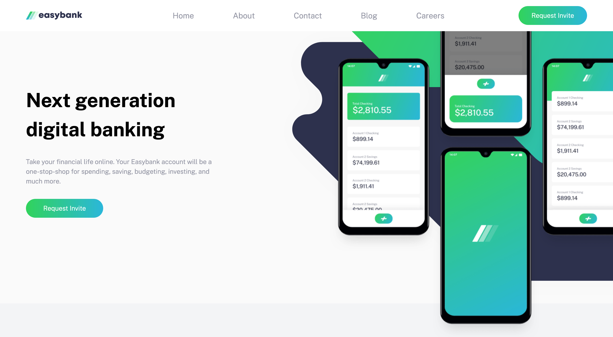
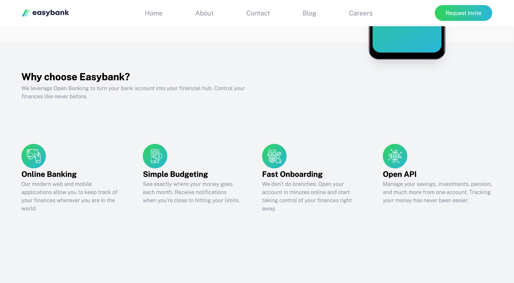
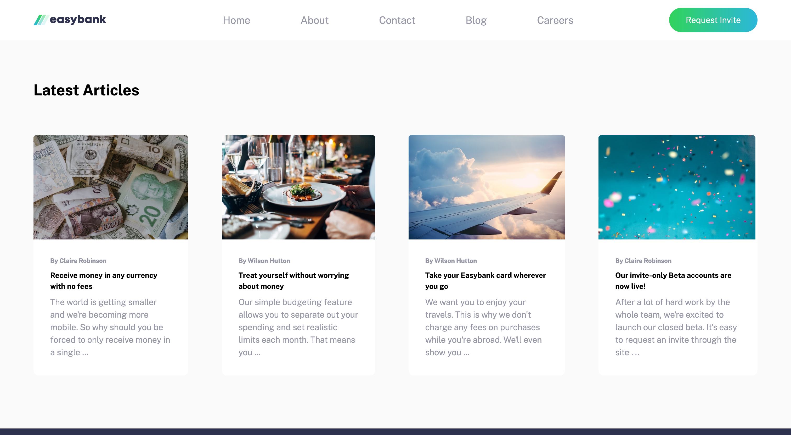
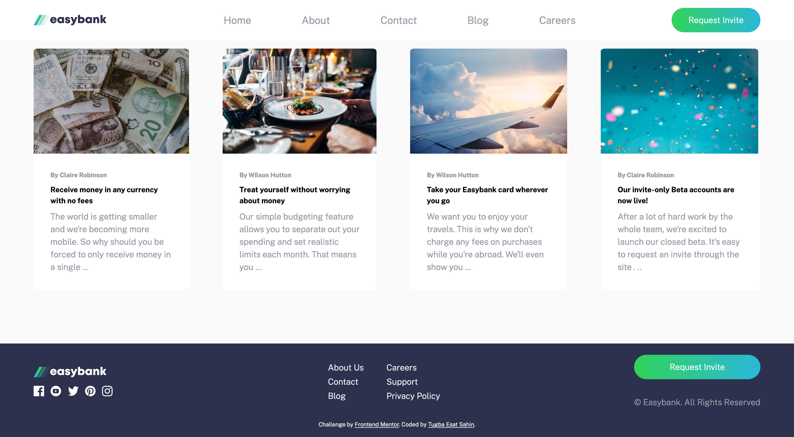

# Frontend Mentor - Easybank Landing Page

## About the Project: 📚
This is a Frontend Mentor project, the aim is to build out this landing page and get it looking as close to the design as possible.

Design preview for the Easybank landing page coding challenge:

## Live Demo of the Project: 📹

[Easybank Landing Page](https://bank-landing-page-tugbaesat.vercel.app)

## Technologies, Frameworks and Libraries: ☕️ 🐍 ⚛️
- HTML
- CSS
- JavaScript

## Screenshots: 📷

## Authors: 💻
[@tugbaesat](https://github.com/tugbaesat)

